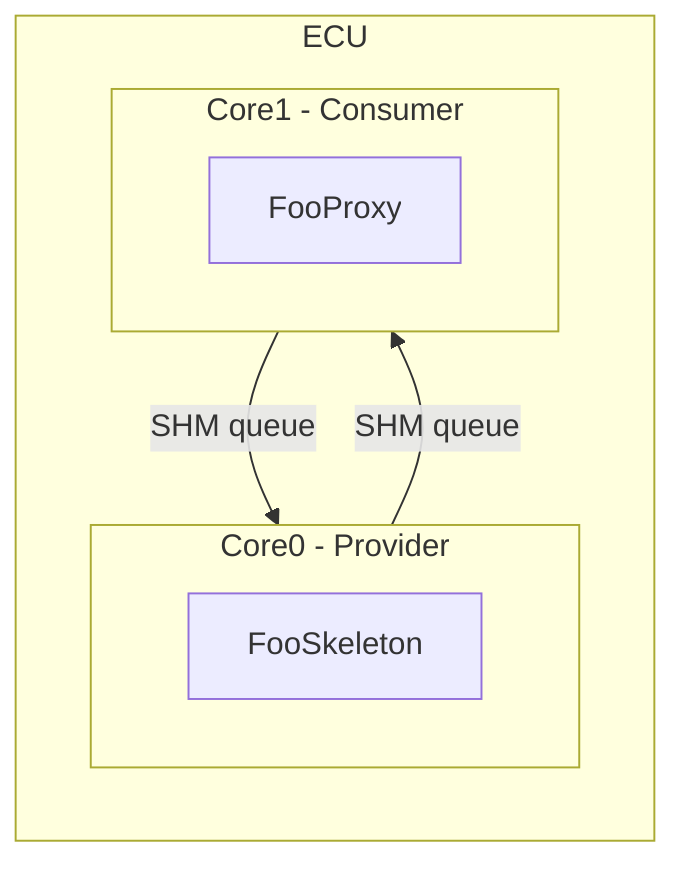

<!--
 *******************************************************************************
  Copyright (c) 2026 BMW AG

  This program and the accompanying materials are made available under the
  terms of the Apache License Version 2.0 which is available at
  https://www.apache.org/licenses/LICENSE-2.0

  SPDX-License-Identifier: Apache-2.0
 *******************************************************************************
-->

# Middleware Simulation Example

- [Overview](#overview)
- [Concepts](#concepts)
- [Configuration](#configuration)
- [Structure](#structure)
- [Initialization](#initialization)
- [Services](#services)
- [Communication](#communication)
  - [Attribute Broadcasts](#attribute-broadcasts)
  - [Attribute Get](#attribute-get)
- [Building](#building)

---

## Overview

This example illustrates the basic principle of how the middleware communicates
between software components on different cores. It uses POSIX shared memory
(SHM) to implement the inter-core queues so that the simulation can run on any
Linux host without real embedded hardware.

Two logical cores are simulated:

| Core  | Role                | Service Role |
|-------|---------------------|-------------|
| Core0 | Provider / Server   | `FooSkeleton` — provides the `Foo` service |
| Core1 | Consumer / Client   | `FooProxy`   — consumes the `Foo` service  |

At startup a shared memory segment is created and the `MemoryLayout` (queues and
allocator pools) is constructed in it via placement new. Both cores are then
started either as **threads** (default) or as **OS processes** (compile-time
option).

---

## Concepts

| Term                    | Description |
|-------------------------|-------------|
| ECU                     | Electronic Control Unit. In this simulation the host process is considered to be the ECU. |
| Proxy                   | A class providing the API for using a service. Instantiated by the service consumer. |
| Skeleton                | A class providing the API for providing a service. Instantiated by the service provider. |
| Service Provider/Server | A software component offering a service. |
| Service Consumer/Client | A software component using a service from a provider. |
| Attribute               | A typed property on the service provider side, defined as part of the service interface. |

---

## Configuration



The deployment model (`model/deployment-test.yaml`) describes:

- **Two clusters**: `Core0` (id 0) and `Core1` (id 1).
- **One service**: `Foo` (namespace `org::test::foo`, id 1) with a single
  read/write attribute `FooDefault` of type `FooStruct { uint32_t fooValue }`.
- **Two connections**:
  - `Core0 -> Core1` skeleton-only: Core0 provides `FooSkeleton`.
  - `Core1 -> Core0` proxy-only: Core1 consumes `FooProxy`.

---

## Structure

```
libs/bsw/middleware/simulation/
+-- model/
|   +-- deployment-test.yaml        # Deployment YAML fed to jinja2cpp.py
+-- include/
|   +-- allocator/
|   |   +-- Allocator.h             # Allocator type alias (Pool<10, 64>)
|   +-- etl_profile.h               # ETL config for host
|   +-- foo/
|   |   +-- FooSkeletonWrapper.h    # FooSkeleton concrete impl (Core0)
|   |   +-- FooProxyWrapper.h       # FooProxy wrapper (Core1)
|   +-- generated_code/             # Output of jinja2cpp.py (tracked in VCS)
|   |   +-- middleware/             # ClusterCore0.h / ClusterCore1.h etc.
|   |   +-- org/test/foo/           # FooCommon.h / FooSkeleton.h / FooProxy.h
|   |   +-- shm/                    # Config.h, QueueDefinitions.h
|   +-- Logger.h                    # Thread-safe simulation logger
|   +-- ShmWrapper.h                # SHM open/mmap wrapper
+-- platform_integration/
|   +-- concurrency/include/        # ScopedCoreLock / ScopedECULock no-op stubs
|   +-- logger/src/LoggerImpl.cpp  # middleware::logger::log() via fprintf
|   +-- os/src/OsDefinitions.cpp   # middleware::os::getProcessId()
|   +-- time/src/SystemTimeProvider.cpp
+-- src/
|   +-- generated_code/             # .cpp files produced by jinja2cpp.py
|   +-- Logger.cpp
|   +-- MainCore0.cpp               # Core0 entry point (FooSkeleton provider loop)
|   +-- MainCore1.cpp               # Core1 entry point (FooProxy consumer loop)
|   +-- Sample.cpp                  # main(): creates SHM, spawns cores
|   +-- ShmWrapper.cpp
+-- docs/
|   +-- README.md                   # This file
+-- CMakeLists.txt
```

---

## Initialization

```
main()
  +- ShmWrapper::init()          -- opens / creates the POSIX SHM segment
  +- createMemoryLayout()        -- placement-new of queues + pools in SHM
  +- [thread|fork] Core0         -- run_main_core0()
  +- [thread|fork] Core1         -- run_main_core1()
```

**Core0 startup** (`run_main_core0`):

1. `middleware::initializeCore0ClusterConnection()` — wires the Core0-side
   cluster to its SHM queues.
2. `FooSkeletonWrapper::init()` — registers the `Foo` service on Core0 with
   `InstanceId_1`.
3. Main loop: calls `sendBroadcast()` every 5 s, processes incoming messages,
   logs stats every 15 s, exits after 60 s.

**Core1 startup** (`run_main_core1`):

1. `middleware::initializeCore1ClusterConnection()` — wires Core1 to its SHM
   queues.
2. `FooProxyWrapper::init()` — registers a change-notification callback on
   `fooDefault` and initialises the `FooProxy` on Core1.
3. Main loop: calls `requestGet()` every 6 s, processes incoming messages, logs
   stats every 15 s, exits after 60 s.

---

## Services

### Foo

| Property       | Value |
|----------------|-------|
| Namespace      | `org::test::foo` |
| Service id     | 1 |
| Instance id    | `InstanceId_1` = 1 |
| Attribute      | `FooDefault` -- `FooStruct { uint32_t fooValue }` |
| Access         | read / write / subscribe |

The `FooSkeletonWrapper` (Core0) increments `fooValue` on every broadcast.
The `FooProxyWrapper<Core1>` receives broadcasts via a registered callback and
also issues explicit getter requests.

---

## Communication

### Attribute Broadcasts

When `FooSkeletonWrapper::sendBroadcast()` is called the skeleton writes the
updated `FooStruct` into the SHM queue towards Core1. The middleware event
mechanism delivers it to the change-notification callback registered via
`fooDefault.setReceiveHandler(...)` on the proxy side.

```
Core0 FooSkeleton::fooDefault.send(data)
         |
         v   SHM queue (Core0 -> Core1)
Core1 FooProxy::onFooDefaultChanged(val)  <- setReceiveHandler callback
```

### Attribute Get

`FooProxyWrapper::requestGet()` sends a getter request through the SHM queue.
The skeleton's `get_FooDefaultAttribute()` override is called, and the response
is routed back to `onGetResponse()` on the proxy side.

```
Core1 fooDefault.get(cb)
         |
         v   SHM queue (Core1 -> Core0)
Core0 FooSkeleton::get_FooDefaultAttribute(response)
         |
         v   SHM queue (Core0 -> Core1)
Core1 onGetResponse(val)
```

---

## Building

### Prerequisites

Standard OpenBSW POSIX build environment (see top-level README).

The simulation requires `BUILD_EXECUTABLE=middlewareSimulation`. This is a
separate build tree from the `referenceApp`; use a dedicated build directory.

```bash
cmake --preset posix-threadx -B build/middleware-sim \
      -DBUILD_EXECUTABLE=middlewareSimulation
cmake --build build/middleware-sim --target middlewareSimulation
```

### Process-based execution

By default the two cores run as **threads** inside a single process.  To run
each core in its own OS **process** (true process isolation via `fork`):

```bash
cmake --preset posix-threadx -B build/middleware-sim \
      -DBUILD_EXECUTABLE=middlewareSimulation \
      -DSIMULATION_USE_PROCESSES=ON
cmake --build build/middleware-sim --target middlewareSimulation
```

### Run

```bash
./build/middleware-sim/libs/bsw/middleware/simulation/Release/middlewareSimulation
```

### Regenerating code

If the deployment model (`model/deployment-test.yaml`) is changed, regenerate
the C++ code with:

```bash
python3 libs/bsw/middleware/tools/cpp_generator/jinja2cpp.py \
  --input  libs/bsw/middleware/tools/cpp_generator \
  --output libs/bsw/middleware/simulation \
  --deployment-yaml libs/bsw/middleware/simulation/model/deployment-test.yaml
```

See `libs/bsw/middleware/tools/cpp_generator/README.md` for full generator
documentation.
